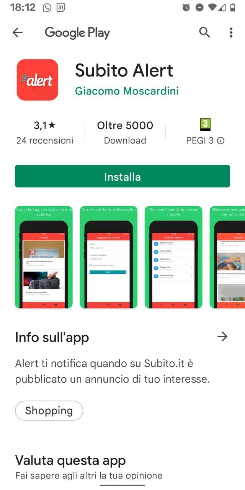
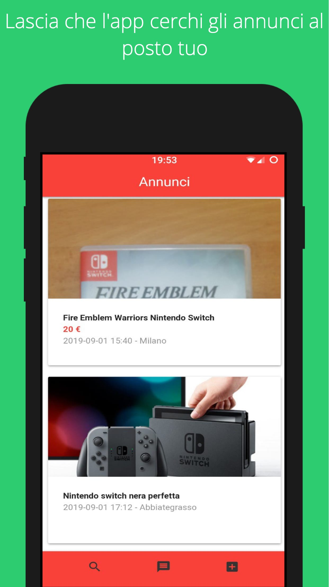
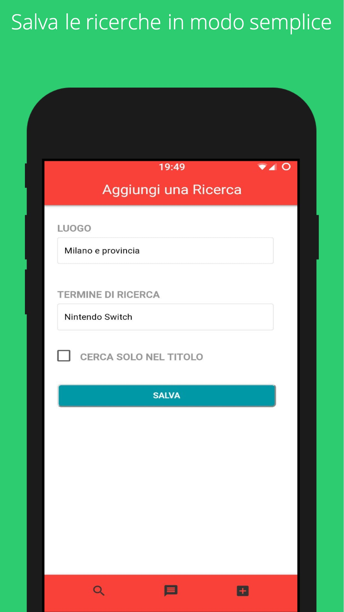

# Description
TWA that inform the user of a new announcement on subito.it

## Relevant Technologies used
1. [PWA](https://web.dev/progressive-web-apps/)
2. [TWA](https://medium.com/@elliatab/trusted-web-activities-for-android-developers-4d8dea3dac9a)
3. [Service Worker](https://developer.mozilla.org/en-US/docs/Web/API/Service_Worker_API)
4. [Web Push Notification](https://developer.mozilla.org/en-US/docs/Web/API/Push_API)

## Screenshot

  
   
  

